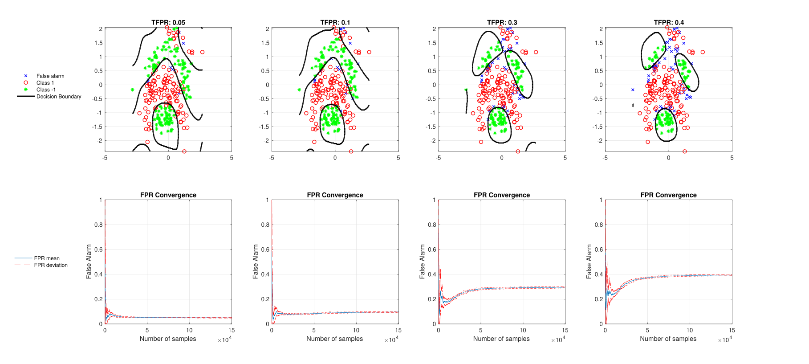
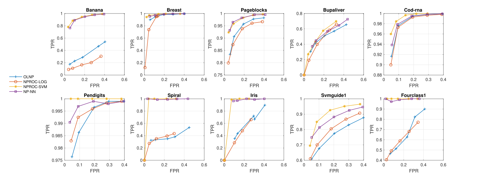

# A Neural Network Approach for Online Nonlinear Neyman-Pearson Classification
This is the repository for Online Nonlinear Neyman Pearson Classifier described in [1]: https://ieeexplore.ieee.org/stamp/stamp.jsp?arnumber=9265182
Using this repository, you can test and train the model.

# Running the Model

# Running the Model with a new data set

# Hyperparameter Tuning

Thanks!
Basarbatu Can