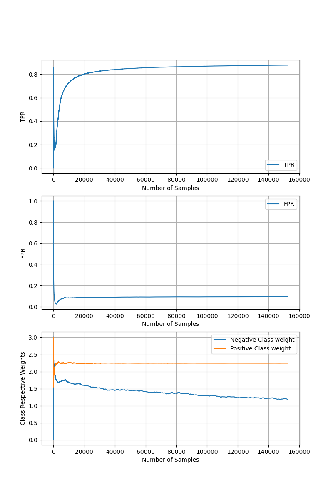
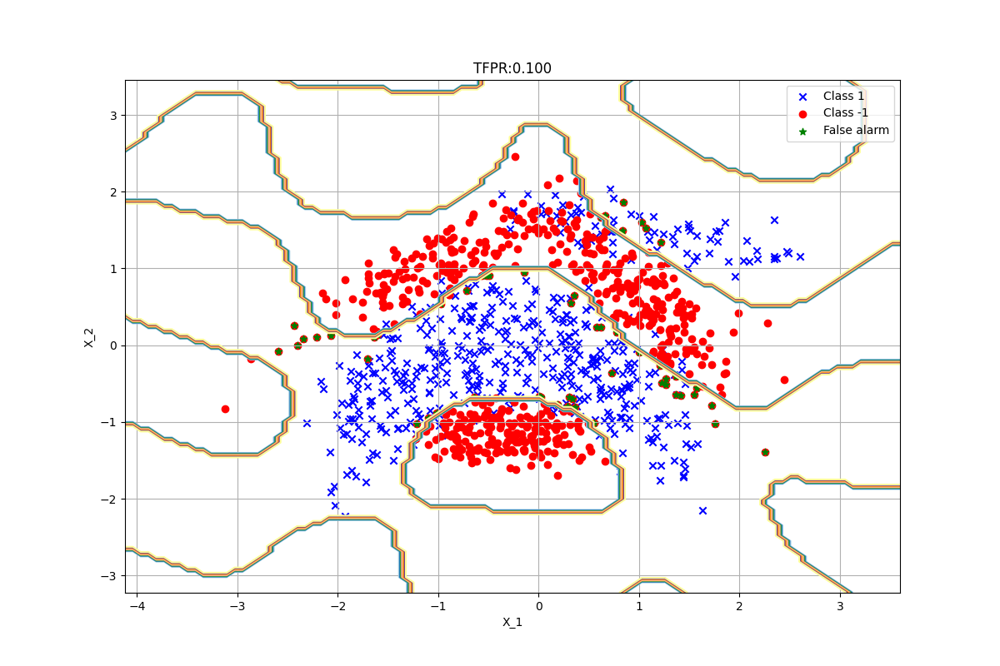

# A Neural Network Approach for Online Nonlinear Neyman-Pearson Classification
This is the repository for Online Nonlinear Neyman Pearson (NP) Classifier described in [1]: https://ieeexplore.ieee.org/stamp/stamp.jsp?arnumber=9265182.  
Proposed model is an online, nonlinear NP classifier. In NP framework, the target is to maximize detection power while upper-bounding the false alarm. Implemented model is compatible with sklearn's gridsearchcv function. It can be used for fine tuning. You can find example usage below. 

# NPNN parameters
    tfpr_=0.1                # target false alarm
    eta_init_=0.01           # initial learning rate for perceptron
    beta_init_=100           # initial learning rate for class weights, this is scaled by 1/total_number_of_negative_samples in code for better convergence
    sigmoid_h_=-1            # sigmoid function parameter
    Lambda_=0                # regularization parameter
    D_=2                     # number of fourier features (higher dimensional space will have 2*D dimensions, it is better to have D>input dimension for good performance)
    g_=0.1                   # bandwidth of RBF kernel

# Example Usage
    import pandas as pd
    from sklearn.model_selection import train_test_split, GridSearchCV
    from sklearn.metrics import confusion_matrix
    from sklearn.preprocessing import StandardScaler
    import matplotlib.pyplot as plt
    import numpy as np

    from npnn import npnn

    # Target False Alarm
    # NP framework aims to maximize the detection power while upper bounding the false alarm rate
    # target false alarm rate should be determined by the user
    target_FPR = 0.1

    # main 
    # np-nn works for 1,-1 classification
    # we expect data to be in tabular form with the latest column as target (check ./data/banana.csv)
    data = pd.read_csv('./data/banana.csv')
    X = data.iloc[:,:-1].values
    y = data.iloc[:,-1].values

    # train test split
    X_train, X_test, y_train, y_test = train_test_split(X, y, test_size=0.2, random_state=0)

    # normalization
    sc = StandardScaler()
    X_train = sc.fit_transform(X_train)
    X_test = sc.transform (X_test)

    # define hyperparameters
    parameters = {
        'eta_init': [0.01],               # default, 0.01
        'beta_init': [100],               # default, 100
        'sigmoid_h': [-1, -2],            # default, -1
        'Lambda':[0, 1e-4],               # default, 0
        'D':[2, 4],                       # default, 2
        'g':[0.1, 1]                      # default, 1
        }

    # define classifier
    NPNN = npnn(tfpr=target_FPR)

    # hyperparameter tuning
    clf = GridSearchCV(NPNN, parameters, verbose=3, cv=2, n_jobs=-1)

    # training
    clf.fit(X_train, y_train)

    # print best params
    print(clf.best_params_)

    # get best estimator
    best_NPNN = clf.best_estimator_

    # prediction
    y_pred = best_NPNN.predict(X_test)

    # evaluation
    tn, fp, fn, tp = confusion_matrix(y_test, y_pred).ravel()
    FPR = fp/(fp+tn)
    TPR = tp/(tp+fn)
    print("NPNN, TPR: {:.3f}, FPR: {:.3f}".format(TPR, FPR))

# Learning Performance
* Below graph visualizes how TPR, FPR and corresponding class weights are being updated during training.
* Note that NPNN augments data to 150k samples (shuffle + concatenation) for better convergence.

# Expected Decision Boundaries
Visualization of decision boundaries for 2D dataset. 

Thanks! 
Basarbatu Can, PhD

# References
[1] Can, Basarbatu, and Huseyin Ozkan. "A Neural Network Approach for Online Nonlinear Neyman-Pearson Classification." IEEE Access 8 (2020): 210234-210250.