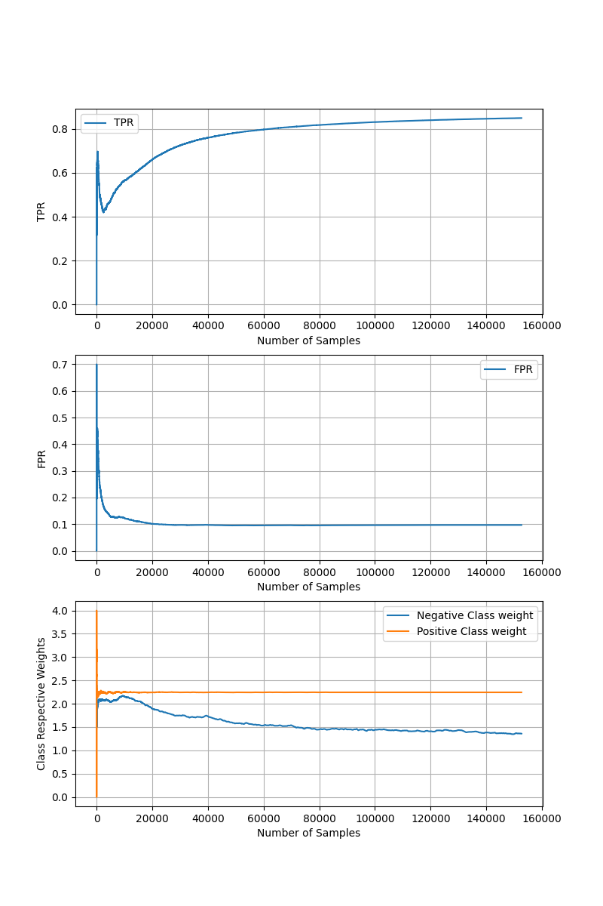

# A Neural Network Approach for Online Nonlinear Neyman-Pearson Classification
This is the repository for Online Nonlinear Neyman Pearson (NP) Classifier described in [1]: https://ieeexplore.ieee.org/stamp/stamp.jsp?arnumber=9265182. 
Proposed model is an online, nonlinear NP classifier. In NP framework, the target is to maximize detection power while upper-bounding the false alarm.

# NPNN parameters
    tfpr_=0.1                #target false alarm
    eta_init_=0.01           # initial learning rate for perceptron
    beta_init_=100           # initial learning rate for class weights, this is scaled by 1/total_number_of_negative_samples in code for better convergence
    sigmoid_h_=-1            # sigmoid function parameter
    Lambda_=0                # regularization parameter
    D_=2                     # number of fourier features (higher dimensional space will have 2*D dimensions, it is better to have D>input dimension for good performance)
    g_=0.1                   # bandwidth of RBF kernel

# Example Usage
    import pandas as pd
    from sklearn.model_selection import train_test_split
    from sklearn.metrics import confusion_matrix
    from sklearn.preprocessing import StandardScaler
    import matplotlib.pyplot as plt
    import numpy as np
    from npnn import npnn

    data = pd.read_csv('./data/banana.csv')
    X = data.iloc[:,:-1].values
    y = data.iloc[:,-1].values
    
    X_train, X_test, y_train, y_test = train_test_split(X, y, test_size=0.2, random_state=0)
    
    sc = StandardScaler()
    X_train = sc.fit_transform(X_train)
    X_test = sc.transform (X_test)
    
    NPNN = npnn(D_=15, g_=1, tfpr_=0.1)
    
    NPNN.fit(X_train, y_train)
    
    y_pred = NPNN.predict(X_test)
    
    tn, fp, fn, tp = confusion_matrix(y_test, y_pred).ravel()
    FPR = fp/(fp+tn)
    TPR = tp/(tp+fn)
    print("NPNN, TPR: {:.3f}, FPR: {:.3f}".format(TPR, FPR))

# Learning Performance
* Below graph visualizes how TPR, FPR and corresponding class weights are being updated during training.
* Note that NPNN augments data to 150k samples (shuffle + concatenation) for better convergence.

# Expected Decision Boundaries
Visualization of decision boundaries for 2D dataset. 

Thanks!
Basarbatu Can

# References
[1] Can, Basarbatu, and Huseyin Ozkan. "A Neural Network Approach for Online Nonlinear Neyman-Pearson Classification." IEEE Access 8 (2020): 210234-210250.